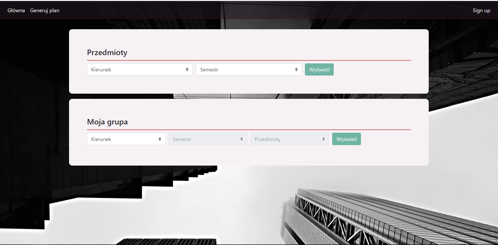
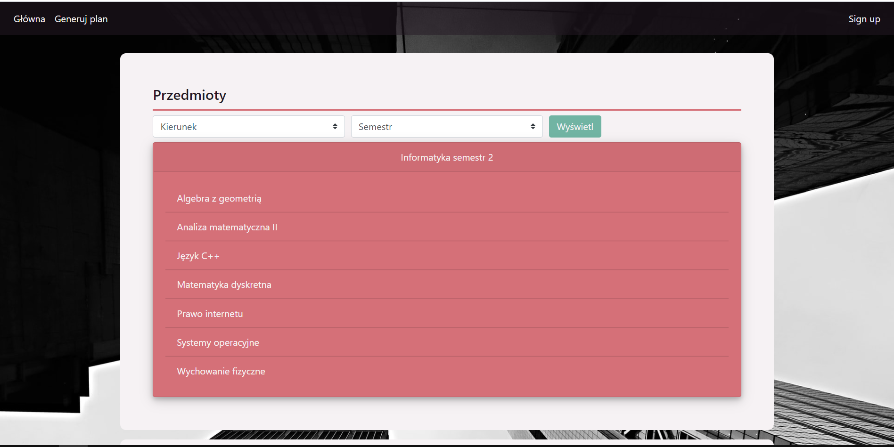
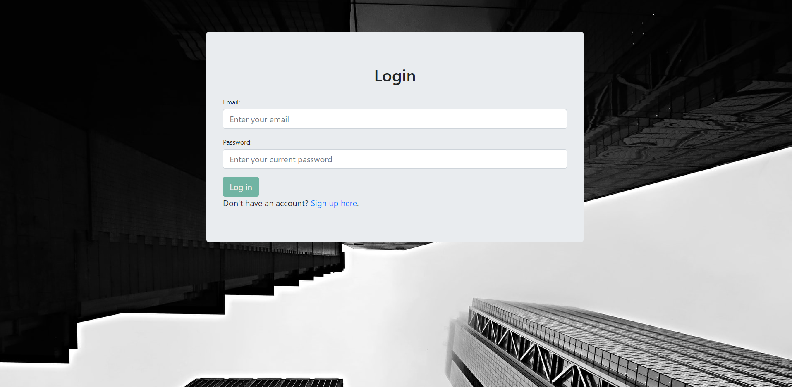
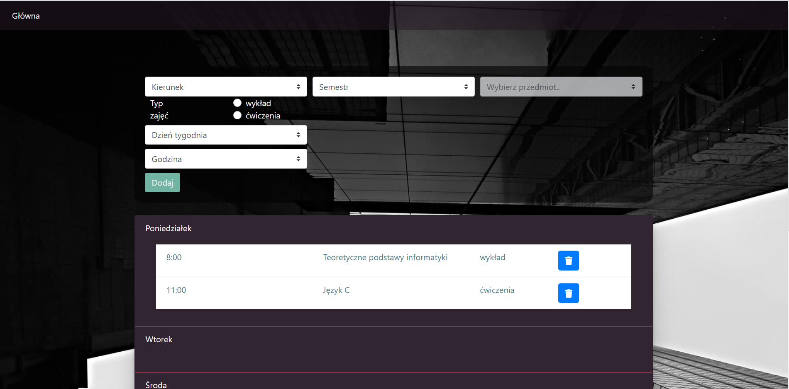

# Project Name
> Your schedule
This is a Node.js application for students. It mainly allows students to create their personal schedule. In addition, they can check the list of subjects for a course and semester or list their group members of a particular subject. All information is up-to-date thanks to database connection.

## Table of contents
* [Technologies](#technologies)
* [Setup](#setup)
* [Features](#features)
* [Screens](#screens)
* [Status](#status)

## Technologies
* CSS, Jade 
* JavaScript
* Node.js
* Express
* Mysql

## Setup
To setup an application you should firstly clone this repo and run `npm install` to install all dependencies.
Then, in order to run, you should write command `npm start`. You will be able to access it at localhost:3112.

## Features

* Interactive planning
* User-friendly interface
* Checking subjects for a course and group members
* Login and personal shedules

## Screens

### Landing page

## Checking subjects for a course

### Log in

### Schedule creation

